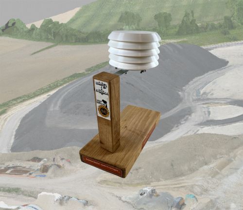

## Network of sensors monitoring air quality parameters.  

*The Zéphyr sensor on its demonstration support and in the background of the image the pile of gravel from the Puylaurens power plant.*

The Zéphyr sensor is an instrument that measures up to 9 physical air quality parameters:

* Particles from 1 to 10µm: PM1, PM2.5, PM4 and PM10 
* Volatile Organic Compounds VOCs
* Nitrogen Oxides Nox
* Air humidity
* Ambient temperature
* CO2 content (optional)  

It was developed during the fight against the A69 motorway project (Tarn/Haute-Garonne, Occitanie region in France) to oppose the establishment of two bitumen power plants whose authorities government authorities did not fully appreciate public health and environmental issue**s.

The operation was carried out at the initiative of the Lauragais Sans Bitume [LSB](https://www.lauragais-sansbitume.fr/) collective, supported by 11 other local bitumen-free collectives.

The sensors and the computer architecture to manage the data were designed by a group of enlightened amateurs from the territory impacted by the power plants, supported by the Granas de Carderas association which distributes the sensors from its [HelloAsso](https://www.helloasso.com/associations/granas-de-carderas) sales website.

The sensors deployed (more than 60 to date) send their data every 5 minutes to a server which allows the owners of the sensors to access a dashboard and everyone to view the mapping of the quality of air in real time.

[For more information see our GitBook site:](https://rhizobiome.gitbook.io/atrosca-degaze)

## *Credits*

We would like to thank the people who participated, on a voluntary basis, in this initiative.
The people involved were able to provide their skills in various areas to make this project a reality:

* Design & technical design of circuits to operate sensors
* 3D printing and assembly of the boxes in which the sensors are embedded
* Provision of a server and hosting
* Integration of applications (open source) used to collect data
* Development of the dasboards presented here
* Coordination of the project and all the skills necessary to achieve this result

All this without forgetting the contributors who took the step of acquiring a Zéphyr sensor and making the measurements taken by them available.
THANKS !!
